# Homelab

A single-node Proxmox setup running self-hosted services for personal and family use. The focus is on learning by doing - setting up, maintaining, and eventually monitoring real infrastructure rather than just reading about it.

Infrastructure automation is handled via Ansible.
Repository (currently set to private): [homelab-ansible](https://github.com/gigan0815/homelab-ansible)

## Hardware

| Component | Details |
|-----------|---------|
| Device | ASUS PN52 Mini PC |
| CPU | AMD Ryzen 9 5900HX |
| RAM | 16GB |
| Storage | 2x 3TB HDD - ZFS, mirror via USB enclosure |
| Hypervisor | Proxmox VE |

## Network

| Device | IP | Role |
|--------|----|------|
| UniFi Express 6 | 192.168.1.1 | Gateway / Router / DHCP Server |
| USW Flex Mini - HAR | 192.168.1.4 | Main switch to patch panel |
| USW Flex Mini - Büro | 192.168.1.5 | Office switch |
| AP Wohnzimmer | 192.168.1.2 | Access Point |
| AP Obergeschoss | 192.168.1.3 | Access Point |

## Services

| Service | IP | Port | Description |
|---------|-----|------|-------------|
| paperless-ngx | 192.168.1.12 | 8000 | Document management system |
| sabnzbd | 192.168.1.13 | 7777 | Binary newsreader |
| prowlarr | 192.168.1.14 | 9696 | Indexer aggregator |
| sonarr | 192.168.1.15 | 8989 | Series library manager |
| radarr | 192.168.1.16 | 7878 | Movie library manager |
| jellyfin | 192.168.1.17 | 8096 | Media server |
| bazarr | 192.168.1.18 | 6767 | Subtitle manager |
| ansible | 192.168.1.19 | - | Ansible control node |
| - | 192.168.1.20 | - | Reserved, fallback IP for conflict solving of Unifi Express 6 |
| prometheus | 192.168.1.21 | 9090 | Metrics collection |
| grafana | 192.168.1.22 | 3000 | Metrics visualization |

## Automation

Infrastructure is managed via Ansible. The control node runs as a dedicated LXC container on the Proxmox host.
Repository (currently set to private): [homelab-ansible](https://github.com/gigan0815/homelab-ansible)

Current playbooks:
- `update.yml` - updates all LXC containers + Discord notification on reboot
- `paperless_backup.yml` - exports paperless-ngx and syncs to OneDrive
- `node_exporter.yml` - deploys Node Exporter on all containers
- `prometheus.yml` - deploys Prometheus on the monitoring container
- `grafana.yml` - deploys Grafana on the monitoring container

## Backup

| Service | Destination | Schedule | Method |
|---------|-------------|----------|--------|
| paperless-ngx | OneDrive | Daily 02:00 | document_exporter + rclone |

Storage redundancy is provided via a hardware RAID mirror on the USB enclosure housing the 2x 3TB drives.
**Note:** USB-based RAID is a known limitation. Migration to ZFS mirror is planned as a future improvement.

## Alerting

Alerts are configured in Grafana and sent to the `#homelab-alerts` Discord channel.

| Alert | Condition | Pending period |
|-------|-----------|----------------|
| Container unreachable | Node Exporter not responding | 2m |
| High CPU usage | CPU > 80% | 15m |
| High RAM usage | RAM > 85% | 5m |
| High SWAP usage | SWAP > 50% | 10m |
| High disk usage | Disk > 85% | 5m |

## Architecture

## Roadmap
- [ ] Migrate USB RAID to ZFS mirror
- [ ] Set up Kubernetes cluster
- [ ] Expand Ansible roles for all services
- [ ] Add Ansible role for Kubernetes cluster setup
- [x] Deploy monitoring stack (Prometheus + Grafana)
